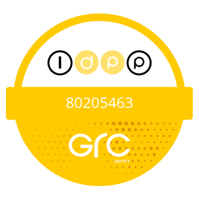

## I am a Certified GRC and Privacy specialist, Systems Thinker, Closet Philosopher, and Software Engineer

- TBC
- TBC

## Tech Stack

        
          
          
          
          

## Github Stats and Activity Summary

## Certifications
    

## My thoughts

